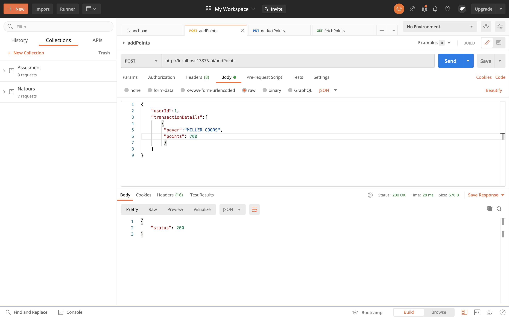

# reward
[![LinkedIn][linkedin-shield]][linkedin-url]


[linkedin-shield]: https://img.shields.io/badge/-LinkedIn-black.svg?style=for-the-badge&logo=linkedin&colorB=555
[linkedin-url]: www.linkedin.com/in/charan-hm


<!-- PROJECT LOGO -->
<br />
<p align="center">
  <a href="https://github.com/othneildrew/Best-README-Template">
    
  </a>
</p>


<!-- TABLE OF CONTENTS -->
<details open="open">
  <summary>Table of Contents</summary>
  <ol>
    <li>
      <a href="#about-the-project">About The Project</a>
      <ul>
        <li><a href="#built-with">Built With</a></li>
      </ul>
    </li>
    <li>
      <a href="#getting-started">Getting Started</a>
      <ul>
        <li><a href="#prerequisites">Prerequisites</a></li>
        <li><a href="#installation">Installation</a></li>
      </ul>
    </li>
    <li><a href="#usingtheservices">Using The Services</a></li>
    <li><a href="#addPoints">Add Points</a></li>
    <li><a href="#acknowledgements">Acknowledgements</a></li>
  </ol>
</details>

<!-- ABOUT THE PROJECT -->
## About The Project

To Build Web Services for:
* Adding Points to Reward Wallet
* Deducting The Points From Reward Wallet
* Fetching The Points Remaining in Reward wallet

### Built With
If you do not have node.js installed use below nodejs link to install it on your PC
* [Nodejs](https://nodejs.org/en/)
* [Express](https://expressjs.com/)

<!-- GETTING STARTED -->
## Getting Started
This is an example of how to list things you need to use the software and how to install them.
* npm
  ```sh
  npm install npm@latest -g
  ```

  ### Installation
1. Clone the repo
   ```sh
   git clone https://github.com/charan-ui/reward.git
   ```
2. Install NPM packages
   ```sh
   npm install
   ```
3. In your Project Terminal run
   ```sh
   npm run dev
   ```
   After This you will see a log on your terminal like this  "Express server listening on port  1337"
   Indicating the the server is ready

   ### usingtheservices
1. I Use Postman Client to use my REST Web Services , you are allowed to use any API Clients for this
   Purpose
   If you Have not Installed Postman on your device Please use the below URL For downloading it
   * [POSTMAN](https://www.postman.com/downloads/)

   ### addPoints
1. Request Screen shot
<br />
<p align="center">
  <a href="https://github.com/othneildrew/Best-README-Template">
    
  </a>
</p>

   This is a Post Request and Payload required for this is shown in the above Image
